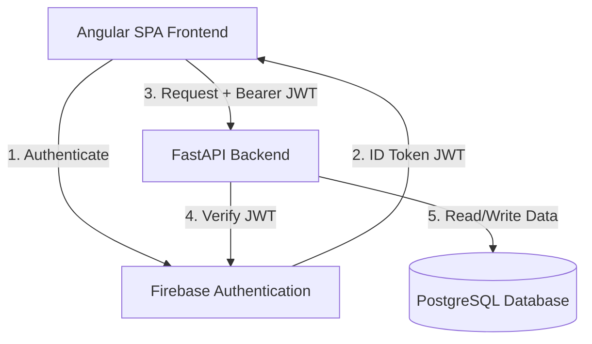
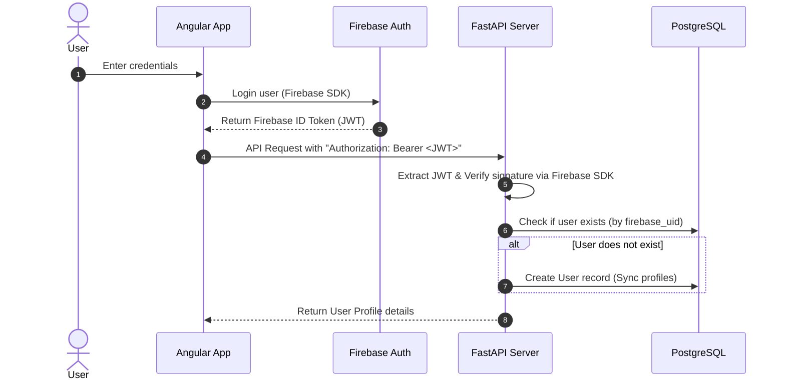

# LifeCopilot Technical Architecture - Phase 1

This document provides a high-level overview of the architectural design, directory standards, and authentication workflows established for the LifeCopilot application.

---

## 1. System Overview

LifeCopilot is designed as a modular, decoupled web application split into an Angular frontend and a FastAPI backend. Authentication is handled by **Firebase Authentication**, ensuring security at the edge before requests hit the backend API server.

---

## 2. Frontend Architecture (Angular)

The Angular frontend is built following a **Feature-First Architecture** combined with Angular standalone standards. 

### Architecture Directories

* **`core/`**: Central singletons. Includes services like Firebase authentication (`auth.service.ts`), client configurations (`api.config.ts`), and interceptors.
* **`features/`**: Code grouped by business domains.
  * `auth/`: Login and registration components.
  * `dashboard/`: Logged-in overview screen.
  * `profile/`: Account settings page.
* **`shared/`**: Presentational components, UI buttons, pipes, and directives shared across multiple features.

### Reactive State & Signals
Instead of heavy state management frameworks, Angular **Signals** track user authentication statuses, loaded profile details, and loading states reactively.

---

## 3. Backend Architecture (FastAPI)

The backend follows a clean architecture layout. Logic is split into feature directories containing controllers (`router.py`), data validation schemas (`schemas.py`), database structures (`models.py`), and transactional logic (`service.py`).

### Key Modules
1. **Core Settings (`core/config.py`)**: Type-safe settings loaded from environment files using Pydantic Settings.
2. **Database Engine (`core/database.py`)**: Asynchronous engine using SQLAlchemy and asyncpg.
3. **Security (`core/security.py`)**: Implements JWT signature and validity checks against Firebase credentials using the Firebase Admin SDK.

---

## 4. Authentication Flow

